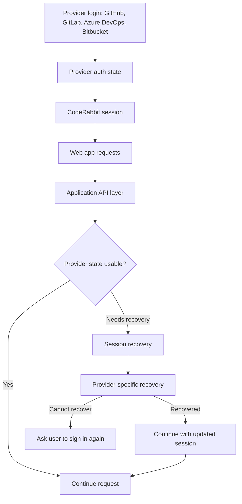
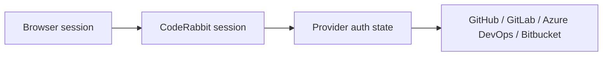
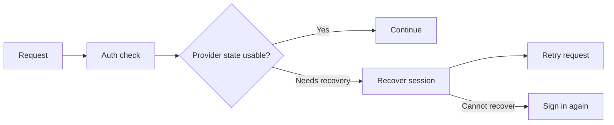
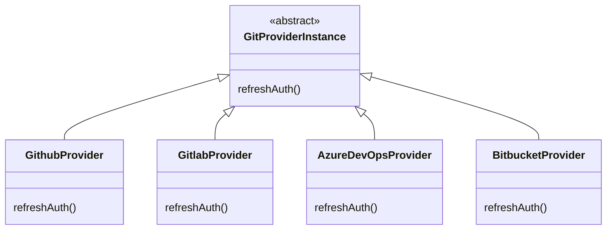

CodeRabbit supports login across multiple code hosting providers. That flexibility is useful, but it also means the web app has to deal with different auth models, session lifetimes, and provider-specific behavior.

For a while, the web app had a client side auth setup. When someone logged in through GitHub, GitLab, Azure DevOps, Bitbucket, or any other supported provider, the app carried provider auth state forward for later requests.

It worked fine until that state could no longer be used.

And provider auth state does expire. A user could still have the tab open, still be "logged in" from the browser's point of view, and then suddenly hit a wall while changing settings, opening a billing page, or moving around the app.

Nothing looked broken until the moment it was.

## The Problem

Short-lived provider auth is good for security, but it is error prone when the product experience is tied directly to it.

A setup based on provider auth state is short-lived. That meant users had to sign in again more often than they should have, even though they were actively using the app.

The expected solution is to recover the session in the background and let users carry on with the regular navigation.

In practice, it is a bit more nuanced.

Each provider has its own OAuth behavior, failure modes, and recovery semantics. Some responses clearly tell you the current auth state can no longer be used.
Others need a different recovery path. (This calls for an abstract implementation class).

The end outcome was to make the product session resilient across provider differences.

## Decoupling The Session From Provider Auth

The core idea is that auth session should not be the same thing as provider auth state.

Provider auth state is allowed to be short-lived, but the app experience should not collapse every time it needs to be renewed.

So we added a session layer between the product experience and provider-specific auth. That gave us a cleaner boundary:

- The browser knows it has a session.
- The app can keep the user in flow.
- Provider-specific auth details can be handled behind the scenes.

It also meant existing API calls could become a little less fragile. Instead of every request depending on provider auth lifetime the user does not control, the app could rely on a session model built for the product.

## Recovering During Requests

Recovery now happens where it matters most: when an authenticated action can no longer use the current provider state.

In recoverable cases, the app can renew what it needs and continue without forcing the user through login again. When recovery is not possible, the user is still asked to sign in again.

From the user's perspective, the page just continued to work.

That is the intended behavior. A user should not have to know that provider auth needed recovery in the middle of opening a settings page. They should only be asked to sign in again when the product cannot recover.

The tricky part was making this work across providers without turning the codebase into a pile of one-off conditionals. The details differ per provider, but the product behavior should stay the same.

## Architectural Design

The implementation separated CodeRabbit's product session from provider auth lifetimes, applied that consistently across API paths, then added recovery around auth expiry.

The provider-specific behavior sits behind an abstract `GitProviderInstance`, with concrete implementations like `GithubProvider` and `GitlabProvider` exposing a common `refreshAuth()` method.

That touched more surface area than it may sound like. Auth had quietly grown around the old model, so the change had to work across existing API paths, provider flows, organization context, and the places where users switch between parts of the app.

## Result

The app started to feel more stable because active users were no longer pushed back into login for recoverable auth states.

For a tool like CodeRabbit, that continuity matters. People are often in the middle of reviewing code, changing repository settings, or managing a team. Getting interrupted by auth breaks the flow of work.

With this update, CodeRabbit has a session model built around the product experience, while still respecting the shorter auth lifetimes and different recovery paths of each provider.
