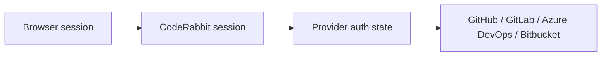

CodeRabbit supports login across GitHub, GitLab, Azure DevOps, Bitbucket, and other code hosting providers. This feature enables diverse engineering teams across providers to use CodeRabbit, but it also makes authentication difficult to architect and maintain.

This post walks through how CodeRabbit moved from provider-bound auth state to a new session model that keeps users consistently signed in while handling auth expiration failures behind the scenes.

## The Problem

An authentication model with short-lived auth state is a good pattern for security, but it becomes undesirable when the product experience is tied directly to it.

For a CodeRabbit user, that meant they could be signed out in the middle of a workflow while changing repository settings, assigning seats, or even navigating between pages.

Hence, we had to build a resilient model which could handle sessions in the background while users carried on with their work.

## The Solution: Enter CodeRabbit Session

We introduced a new layer between the browser and CodeRabbit's backend services: CodeRabbit session.

When a user signs in, CodeRabbit creates a session and stores its identifier in the browser as an HTTP-only `session-id` cookie. On later requests, the browser sends that cookie back to CodeRabbit. The backend validates the session, resolves the user and workspace context, and authorizes access to CodeRabbit resources based on that session.

This changes what the browser is responsible for. Before, the app experience was too closely tied to provider auth state. After this change, the browser only needs to send `session-id` during normal product navigation. CodeRabbit's backend services decide on the authorization: whether the session is valid and what the user can access.

The provider's own auth still exists, but it is no longer owned by the browser. It stays abstracted behind the backend services and is used when CodeRabbit needs to call GitHub, or another provider.

That gives the system a cleaner model:

- The browser stores `session-id`.
- CodeRabbit's backend validates the session.
- Product authorization is based on the valid CodeRabbit session.
- Provider auth is handled separately when backend services need provider access.

As a result, existing API calls go through CodeRabbit's own session layer.

```mermaid
flowchart LR
  A[Browser session]
  B[CodeRabbit session]
  C[Provider auth state]
  D[GitHub / GitLab / Azure DevOps / Bitbucket]

  A --> B
  B --> C
  C --> D
```

Figure 1. The CodeRabbit session sits between browser continuity and provider-specific auth state.

## Recovering During Requests

Adding a session layer makes the product secure and robust, but it does not solve the case when auth has expired after a few hours.

A request can still reach the backend with a valid `session-id` and fail because the provider auth state behind it has expired.

For example, the user may still have a valid CodeRabbit session, but the backend can no longer use the stored GitHub auth state needed by that request.

This is where we needed to implement a recovery mechanism.

When an API request fails with a `401 Unauthorized`, the backend checks whether the CodeRabbit session is still valid. When it is valid, the system attempts to refresh provider auth through the provider implementation, then retries the original request.

If there is no valid CodeRabbit session, or the provider auth cannot be refreshed, the user is signed out.

## Architectural Design

We decided to store the new session state in Redis as a central place to expire or invalidate sessions and for faster lookups.

The browser keeps the `session-id`, while Redis holds the server-side session data and provider auth state used by backend services.

The request recovery mechanism sits on top of that model. When an API request fails because of session expiration, the backend does not immediately sign the user out. It first checks whether the CodeRabbit session is still valid.

If the session is valid, it asks the active provider implementation to refresh auth, then retries the original request.

## Summary

By adding a new session layer, we have made the user experience more predictable. Users can open the CodeRabbit app from different links, work across multiple browser tabs, and return to an existing workflow without interruption.

Additionally, implementation also improved the security posture of the app. Rather than exposing sensitive auth state in the browser via local storage or session storage APIs, it is neatly implemented behind a server-side abstraction with a clear separation of concerns.

Together, these changes have made CodeRabbit more robust in day-to-day product usage.
